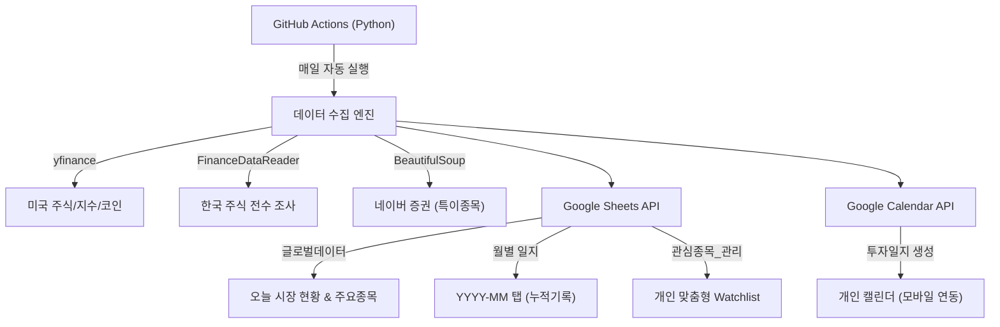

# 📊 Google Sheet Stock Updater

자동화된 주식/코인 시장 데이터 수집 및 구글 시트/캘린더 연동 시스템

## 🎯 주요 기능

- **자동 데이터 수집**: 한국/미국 주식, 주요 지수, 환율 정보 자동 수집
- **특이종목 전수 조사**: `FinanceDataReader`와 네이버 증권을 활용한 상한가/고거래량 종목 탐지 (주말 대응 가능)
- **구글 시트 연동**: 글로벌데이터 시트 및 월별 일지 자동 업데이트
- **구글 캘린더 연동**: 일별 시장 현황을 담은 투자일지 자동 생성 (중복 방지 로직 적용)
- **GitHub Actions 자동화**: 매일 자동 실행 (한국 시간 기준)

## 🏗️ 시스템 구조



### 시스템 계층 구조
1.  **데이터 레이어 (Google Sheets)**: 글로벌데이터, 스크리너, 이벤트, 관심종목_관리
2.  **연산 레이어 (Python/Github Actions)**: 수집, 분석(특이종목/추천의견), 포맷팅
3.  **UI 레이어 (Calendar/Sheets)**: 일별 요약 이벤트, 실시간 시트 뷰어
4.  **아카이빙 레이어 (Sheets)**: 월별 투자 기록 자동 보관

## ⚙️ 동작 환경

### 🔹 **실행 환경: GitHub Actions (클라우드)**

이 프로그램은 **GitHub Actions**에서 자동으로 실행됩니다:
- ✅ **로컬 환경 불필요**: 사용자 PC에 Python이나 라이브러리를 설치할 필요 없음
- ✅ **서버리스**: GitHub의 클라우드 서버에서 자동 실행
- ✅ **무료**: GitHub Actions 무료 사용량 내에서 운영

### 🔹 **로컬 실행 (선택사항)**

개발 또는 테스트 목적으로 로컬에서 실행하려면:

1. **.env 파일 설정**:
   - `.env.example`을 복사하여 `.env` 파일을 생성하고 실제 값을 입력합니다.
   - `GOOGLE_CREDENTIALS_JSON`은 서비스 계정 JSON 내용을 한 줄로 입력하거나 파일 경로를 사용합니다.

2. **라이브러리 설치**:
   ```bash
   pip install -r requirements.txt
   ```

3. **실행**:
   ```bash
   python updater.py
   ```

> ⚠️ **주의**: 로컬 실행은 개발/테스트 용도이며, 실제 운영은 GitHub Actions에서 자동으로 처리됩니다.

## 📋 설정 가이드

자세한 설정 방법은 [`docs/setup_guide.md`](docs/setup_guide.md)를 참조하세요.

### 필수 설정 항목

1. **Google Cloud 서비스 계정** 생성 및 JSON 키 다운로드
2. **Google Sheets** 공유 (서비스 계정 이메일로)
3. **Google Calendar** 공유 (서비스 계정 이메일로)
4. **GitHub Secrets** 등록:
   - `GOOGLE_CREDENTIALS_JSON`: 서비스 계정 JSON 키 전체 내용
   - `SPREADSHEET_ID`: 구글 시트 ID
   - `CALENDAR_ID`: 구글 캘린더 ID

### 1. 글로벌데이터 (Live Status)
| 섹션 | 설명 |
| :--- | :--- |
| **Market Summary** | 지수(KOSPI, S&P500 등) 및 환율 실시간 변동현황 |
| **주요 종목 데이터** | 설정된 주요 종목(AAPL, NVDA, 삼성전자 등)의 현재가 및 시총 |

### 2. 관심종목_관리 (User Input)
사용자가 직접 관리하는 시트로, 프로그램이 가격과 의견을 자동으로 업데이트합니다.
- **컬럼**: `Country`, `Ticker`, `Name`, `Asset`, `Memo`, `Alert_Price`, `Recommendation`, `Expert_Opinion`
- **자동 업데이트**: `Recommendation` (시스템 추천가), `Expert_Opinion` (전문가 의견)

### 3. 월별 일지 (History Archive)
매월 `YYYY-MM` 형식의 탭이 자동 생성되며, 시장 요약과 특이 종목이 기록됩니다.
- **컬럼**: `Date`, `Market Summary`, `Watchlist Status`, `Unusual Stocks`, `Version`

## 🔄 자동 실행 스케줄

GitHub Actions는 다음 시간에 자동 실행됩니다 (한국 시간 기준):

- **오전 08:01**: NXT 시작 및 모닝 브리핑 (미국장 마감 결과 포함)
- **오전 09:00**: 정규장 시작 전 데이터 수집
- **오후 16:00**: 정규장 마감 후 데이터 수집
- **오후 20:01**: NXT 마감 및 이브닝 브리핑 (미국 프리마켓 포함)

> 스케줄 변경: `.github/workflows/daily_sync.yml` 파일의 `cron` 설정 수정

## 📁 프로젝트 구조

```
GoogleSheetStockUpdater/
├── updater.py              # 메인 프로그램
├── requirements.txt        # Python 의존성
├── .github/
│   └── workflows/
│       └── daily_sync.yml  # GitHub Actions 워크플로우
└── docs/
    ├── setup_guide.md      # 설정 가이드
    ├── walkthrough.md      # 기능 설명
    └── technical_spec.md   # 기술 사양
```

## 🛠️ 기술 스택

- **Python 3.x**
- **라이브러리**:
  - `yfinance`: 미국 주식/지수 데이터
  - `FinanceDataReader`: 한국 주식 시장 전수 조사 및 데이터
  - `BeautifulSoup4`: 네이버 증권 데이터 스크래핑
  - `python-dotenv`: 로컬 환경 변수 관리
  - `gspread`: Google Sheets API
  - `google-api-python-client`: Google Calendar API
  - `gspread-formatting`: 시트 서식 지정
- **자동화**: GitHub Actions

## 🌟 특별 기능

### 특이종목 전수 조사 (FDR)

단순한 상위 20개 랭킹을 넘어, 시장 전체 종목을 스캔하여 다음 조건에 맞는 종목을 모두 추출합니다:
- **상한가**: 29.5% 이상 상승한 모든 종목
- **고거래량**: 하루 거래량 500만 주 이상의 활발한 종목
- **주말 대응**: 네이버 리스트가 비어있는 주말에도 마지막 거래일(금요일) 데이터를 정확히 수집

### 깔끔한 캘린더 관리

- **제목 형식**: `투자일지 📈 KOSPI +0.75%` (날짜 제거, 중요 정보 우선)
- **중복 방지**: 같은 날짜에 실행 시 기존 투자일지를 자동 삭제하고 최신 정보로 갱신하여 캘린더를 깨끗하게 유지합니다.

## 📝 버전 히스토리

- **v2.0.0** (2026-01-10) [LATEST]:
  - **시장 전수 조사 도입**: `FinanceDataReader`를 활용한 KRX 전 종목 스캔 기능 (상한가, 고거래량 완벽 검출)
  - **네이버 스크래퍼 개선**: URL 최신화 및 iframe 직접 호출로 안정성 확보
  - **캘린더 로직 고도화**: 제목 형식 개선 (`투자일지` 전면 배치), 중복 이벤트 자동 삭제/갱신
  - **로컬 개발 환경 최적화**: `.env` 파일 지원 및 상세 가이드 추가
  - **중복 로직 제거**: 불필요한 시장 정보 중복 수집 및 출력 최적화

- **v1.4.0** (2026-01-10):
  - 주말/휴장일 자동 감지 기능 추가
  - 주말에는 코인 데이터만 수집
  - 캘린더 이벤트 주말 전용 형식 추가
  - 월별 시트 Indices Info 컬럼 제거 (중복 제거)
  - 새 월별 탭 생성 시 최신 구조 자동 적용

## 📞 문의 및 기여

이슈나 개선 사항은 GitHub Issues를 통해 제안해주세요.

## 📄 라이선스

MIT License


==== 아래는 수정하지 마시오.
https://docs.google.com/spreadsheets/d/SHEET_ID/edit?gid=0#gid=0
tradingSystem2026 시트에 탭은 다음과 같이 구성 되어 있다. 글로벌데이터, @스크리너, @이벤트, @PnL로그 

A1: 티커	B1:종목명	C1: 거래소	D1: 종가	E1: 거래대금	F1: PER	G1: 시장	H1: 자동티커	G1: NASDAQ TOP
KRX:005930	삼성전자	코스피	#N/A	#N/A			Samsung Electronics Co Ltd	#N/A
=IFERROR(INDEX(SPLIT(IMPORTXML("https://finance.naver.com/item/main.naver?code="&RIGHT(A2,6),"//title"), " :"),1),"unknown")
=IFERROR(INDEX(IMPORTXML("https://finance.naver.com/item/main.naver?code="&SUBSTITUTE(A2,":",""),"//span[contains(text(),'코스피') or contains(text(),'KOSPI')]"),1),"KOSDAQ")
=GOOGLEFINANCE(A2, "price")
=GOOGLEFINANCE(A2, "volume") * GOOGLEFINANCE(A2, "price")