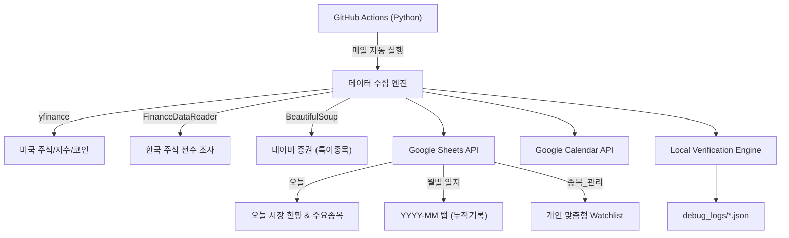

# 📊 Google Sheet Stock Updater

> [!NOTE]
> **AI Requirements**:
> - **Environment**: PowerShell 5.1, GitHub Actions, Google Sheets/Calendar.
> - **Testing**: Unit/Performance tests required, with JSON log verification.
> - **Recovery**: uses `tools\initialize_sheet.py`.
> - **Verification**: uses `tools\verify_sync.py`.

### 🧪 테스트 및 검증 (Testing & Verification)

이 프로젝트는 안정성을 위해 단계별 자동화 테스트를 제공합니다.

1.  **단위 테스트 (Unit Tests)**: 기본 모듈 동작 검증
    ```powershell
    python -m unittest tests/unit/test_verifier.py
    ```

2.  **성능 테스트 (Performance Test)**: 데이터 파이프라인 속도 측정 (목표: <2초 (Mock))
    ```powershell
    python -m unittest tests/performance/benchmark.py
    ```

3.  **통합 검증 (Integration Verification)**: 로컬 데이터 생성 검증 (Dry-Run)
    ```powershell
    # 로그 생성 및 자동 검증 수행
    python tools/verify_sync.py --mode AUTO --validate
    ```

자동화된 주식/코인 시장 데이터 수집 및 구글 시트/캘린더 연동 시스템

## 🎯 주요 기능

- **제로 하드코딩 (Zero Hardcoding)**: 소스 수정 없이 시트에서 직접 지수(Index), 주요종목(Major), 관심종목(Watchlist) 관리 (v2.4.2)
- **자동 데이터 수집**: 한국/미국 주식, 주요 지수, 환율, 가상화폐 24시간 추적
- **버전 히스토리**:
  - v2.7.3: '종목_관리' 탭 시세(현재가/등락/거래량) 컬럼 추가 및 거래량 포맷 개선(K/M/B), 컬럼 순서 최적화(카테고리 우선)
  - v2.7.1: 카테고리 완전 한글화(지수/환율/주요종목/가상화폐/관심종목) 및 시트 명칭 변경(종목_요청/관리)
  - v2.7.0: '오늘' 탭 대시보드화(매번 갱신), '주의종목_버퍼' 도입(누락 방지), 월별 7-Column 구조 개편, 캘린더 연동 고도화
  - v2.6.9: 로컬 검증 시스템(tools/verify_sync.py) 도입 및 데이터 싱크 정합성 강화
  - v2.6.8: 세션 기반 '오늘' 탭 레이아웃 및 캘린더 연동 최적화 (MORNING/MIDDAY/CLOSE/EVENING)
  - v2.6.7: 리포트 3대 체제([주요/관심/특이]) 국가별 세분화 및 과거 데이터 동기화 정책 고도화
  - v2.6.5: Crypto 전용 카테고리 도입 및 대시보드(오늘 탭) 섹션 분리
  - v2.6.4: 기록 기준 날짜 최적화 (시장 데이터 날짜 대신 실제 실행일 기준 기록)
  - v2.6.3: initialize_sheet.py 경고 제거 및 오늘 탭 검증 로직 최적화
  - v2.6.2: 월별 탭 '버전' 컬럼을 '갱신날짜'로 변경 (타임스탬프 기록)
  - v2.4.4: 헤더 전면 한글화, 테마 자동 수집, 정보 링크(주달/야후) 추가, 관리 시트 구조 개선
  - v1.4.0: 주말/휴장일 자동 감지, 코인 데이터 수집, 캘린더 이벤트 주말 전용 형식, 표 중복 제거

- **동적 종목 관리**: `종목_요청` 시트를 통한 간편한 종목 추가/삭제 및 카테고리 분류
- **스마트 스키마**: `종목_관리` 시트에 주가 정보(현재가/변동률/거래량) 자동 추가 및 동기화
- **데이터 보존**: 국장과 미장 업데이트 시점 차이로 인한 데이터 덮어쓰기 방지 (병합 로직)
- **주의종목 전수 조사**: `FinanceDataReader`와 네이버 증권을 활용한 상한가/고거래량 종목 탐지
- **구글 캘린더 연동**: 일별 시장 현황을 담은 투자일지 자동 생성 (중복 방지 로직 적용)
- **GitHub Actions 자동화**: 매일 자동 실행 (한국 시간 기준)

## 🏗️ 시스템 구조



### 시스템 계층 구조

1. **데이터 레이어 (Google Sheets)**: 오늘, 스크리너, 이벤트, 종목_관리
2. **연산 레이어 (Python/Github Actions)**: 수집, 분석(주의종목/추천의견), 포맷팅
3. **UI 레이어 (Calendar/Sheets)**: 일별 요약 이벤트, 실시간 시트 뷰어
4. **아카이빙 레이어 (Sheets)**: 월별 투자 기록 자동 보관

## ⚙️ 동작 환경

### 🔹 **실행 환경: GitHub Actions (클라우드)**

이 프로그램은 **GitHub Actions**에서 자동으로 실행됩니다:
- ✅ **로컬 환경 불필요**: 사용자 PC에 Python이나 라이브러리를 설치할 필요 없음
- ✅ **서버리스**: GitHub의 클라우드 서버에서 자동 실행
- ✅ **무료**: GitHub Actions 무료 사용량 내에서 운영

### 🔹 **로컬 실행 (선택사항)**

개발 또는 테스트 목적으로 로컬에서 실행하려면:

1. **.env 파일 설정**:
   - `.env.example`을 복사하여 `.env` 파일을 생성하고 실제 값을 입력합니다.
   - `GOOGLE_CREDENTIALS_JSON`은 서비스 계정 JSON 내용을 한 줄로 입력하거나 파일 경로를 사용합니다.

2. **라이브러리 설치**:
   ```bash
   pip install -r requirements.txt
   ```

3. **실행**:
   ```bash
   python updater.py
   ```

> ⚠️ **주의**: 로컬 실행은 개발/테스트 용도이며, 실제 운영은 GitHub Actions에서 자동으로 처리됩니다.

## 📋 설정 가이드

자세한 설정 방법은 [`docs/setup_guide.md`](docs/setup_guide.md)를 참조하세요.

### 필수 설정 항목

1.  **Google Cloud 서비스 계정** 생성 및 JSON 키 다운로드
2.  **Google Sheets** 공유 (서비스 계정 이메일로)
3.  **Google Calendar** 공유 (서비스 계정 이메일로)
4.  **GitHub Secrets** 등록:
    - `GOOGLE_CREDENTIALS_JSON`: 서비스 계정 JSON 키 전체 내용
    - `SPREADSHEET_ID`: 구글 시트 ID
    - `CALENDAR_ID`: 구글 캘린더 ID

## 📑 시트 데이터 구조 (Data Structure)

이 프로젝트는 3가지 핵심 시트(탭)를 기반으로 동작합니다.

### 1. 종목_요청 (Request Layer)
사용자가 종목을 추가, 삭제, 수정 요청하는 **Start Point**입니다.
- **역할**: 이 탭에 티커와 정보를 입력하면, 시스템이 유효성을 검증하고 `종목_관리` 탭으로 동기화합니다.
- **필수 컬럼**: `자산`(KR/US/Coin), `티커`, `종목명`, `카테고리`(주요/관심), `RequestEnabled`(TRUE/FALSE)

### 2. 종목_관리 (DB 레이어)
시스템이 실시간 가격과 추천 정보를 자동으로 업데이트하는 핵심 DB 영역입니다.
- **컬럼**: `구분`, `카테고리`, `티커`, `종목명`, `테마`, `메모`, `알림가`, `시스템추천`, `전문가의견`, `정보링크`
- **자동 업데이트**: `테마`, `시스템추천`, `정보링크` (네이버/야후/주달 연동)

### 3. 주의종목_버퍼 (Buffer Layer)
장중 발생하는 특이 종목 데이터를 하루 동안 임시 저장하여 누락을 방지하는 휘발성 버퍼입니다.
- **역할**: 상한가, 거래량 급증 등의 이벤트 종목을 실시간으로 수집 및 누적.
- **컬럼**: `날짜`, `자산`, `티커`, `종목명`, `현재가`, `변동률`, `거래량`, `출처`(상한가/거래량급증/외인매수 등)
- **초기화**: 자정(00시) 기준 혹은 세션 시작 시 자동 초기화.

### 4. 오늘 (Dashboard Mode)
매 실행 시마다 화면을 **초기화하고 새로 작성**하여, 언제 접속하든 가장 최신의 시장 현황을 한눈에 볼 수 있습니다.

| 섹션 | 설명 |
| :--- | :--- |
| **Market Indices** | 주요 지수(KOSPI, S&P500 등) 및 환율 현황 |
| **Watchlist** | 사용자가 등록한 관심종목 시세 |
| **Major** | 시장 핵심 종목(삼성전자, AAPL 등) 모니터링 |
| **Crypto** | 비트코인 등 24시간 자산 시세 |
| **Cautionary** | `주의종목_버퍼`에서 가져온 금일 누적 특이 종목 리스트 |

### 5. 월별 일지 (History Archive)
매월 `YYYY-MM` 형식의 탭이 자동 생성되며, 7개 컬럼으로 세분화된 투자 기록을 남깁니다.
- **컬럼 구조**: `날짜`, `지수/환율`, `관심종목`, `주요종목`, `코인`, `주의종목`, `갱신날짜시간(KR)`
- **데이터 포맷**: `티커 / 이름 / $현재가 / 변동률% / 시스템추천 / 목표가 $알림가 / 정보검색처` (예: `AAPL / Apple Inc. / $150.0 / +1.2% / BUY / 목표가 $145 / 네이버증권`)
- **보존 정책**: 관심종목, 주요종목, 코인, 주의종목 컬럼에 종목이 표시될때 하나하나가 다 위의 포맷 형태로 줄을 바꿔서 추가가 되었으면 함. 단, '주의종목'은 '주의종목_버퍼' 탭에 기록되어 있는 내용을 참고해서 위 데이터 포맷으로 기록을 남겨줘.
- 하루에 여러번 생성이 될 예정이라, 날짜가 같은 것이 없으면 추가. 같은 것이 있으면 갱신을 하면됨.

## 🔄 자동 실행 및 운영 방침 (Operational Policy)

본 시스템은 다음 순서로 데이터를 갱신하여 데이터의 정합성과 최신성을 유지합니다:

1.  **관심종목 동기화**: `종목_요청` -> `종목_관리` 자동 반영 (추가/삭제/분류)
2.  **데이터 상세 갱신**: 테마, 추천의견 등 부가 정보 업데이트
3.  **주의종목 수집 및 버퍼링**: 전수 조사된 특이 종목을 `주의종목_버퍼` 탭에 **누적(Accumulate)** (하루 단위 자동 초기화)
4.  **오늘 탭 갱신 (Dashboard)**: `오늘` 시트를 초기화 후 최신 데이터(지수, 관심, 주요, 코인, 주의종목)로 재작성
5.  **캘린더 연동**: 실시간 데이터를 바탕으로 구글 캘린더에 투자일지(섹션별 요약) 자동 생성
6.  **월별 기록**: 7-Column 구조로 세분화된 데이터를 월별 탭(YYYY-MM)에 누적 기록

### ⚙️ GitHub Actions 자동 실행 스케줄 (Automated Schedule)

`.github/workflows/daily_sync.yml`에 정의된 Cron 스케줄에 따라 한국 시간(KST) 기준으로 하루 4회 자동 실행됩니다.

| KST (한국시간) | UTC (협정세계시) | Cron Expression | 모드 (Mode) | 설명 (Description) |
| :--- | :--- | :--- | :--- | :--- |
| **09:20** | 00:20 | `20 0 * * *` | `MORNING` | 장 시작 전 모닝 브리핑 / NXT 한주 소식 |
| **12:01** | 03:01 | `1 3 * * *` | `MIDDAY` | 국장 오전 세션 점검 |
| **16:00** | 07:00 | `0 7 * * *` | `CLOSE` | 국장 정규장 마감 및 데이터 업데이트 |
| **20:01** | 11:01 | `1 11 * * *` | `EVENING` | NXT 및 전체 마감 / 이브닝 브리핑 |

> **참고**: `workflow_dispatch` 이벤트를 통해 수동으로 실행할 수 있으며, 이때 `target_date`를 입력하여 과거 데이터를 처리할 수 있습니다. 입력이 없으면 `AUTO` 모드로 동작합니다.

## 📚 문서 목록 (Document Index)

이 프로젝트의 모든 문서는 아래에서 바로 접근할 수 있습니다.

- **📄 [README.md](README.md)**: 메인 문서 및 작업 로드맵
- **📘 [setup_guide.md](docs/setup_guide.md)**: 환경 설정 및 설치 가이드
- **📗 [walkthrough.md](docs/walkthrough.md)**: 기능 상세 설명 및 로컬 검증 가이드
- **� [technical_spec.md](docs/technical_spec.md)**: 기술 명세 및 시스템 아키텍처
- **🛠️ [initialize_sheet.py](tools/initialize_sheet.py)**: 시트 복구 및 초기화 도구
- **✅ [verify_sync.py](tools/verify_sync.py)**: 데이터 적재 검증 및 로그 생성 도구
- **📝 [task_log_recent.md](docs/task_log_recent.md)**: 최근 작업 완료 내역 (Archived Task Log)

## �📁 프로젝트 구조 (Project Structure)

```
GoogleSheetStockUpdater/
├── updater.py              # 메인 프로그램 (Entry Point)
├── requirements.txt        # Python 의존성
├── .env                    # 환경변수 (Secrets)
├── .github/
│   └── workflows/
│       └── daily_sync.yml  # GitHub Actions 워크플로우
├── src/                    # 소스 코드 (Core Logic)
│   ├── adapters/           # 외부 API 연동 (Google Sheets, Calendar)
│   ├── services/           # 비즈니스 로직 (Pipeline)
│   └── utils/              # 유틸리티 함수
├── tools/                  # 유지보수 및 검증 도구
│   ├── initialize_sheet.py # 시트 할당/헤더 복구
│   └── verify_sync.py      # 로컬 데이터 검증
└── docs/                   # 프로젝트 문서
    ├── setup_guide.md
    ├── walkthrough.md
    └── technical_spec.md
```

## 🛠️ 기술 스택

- **Python 3.x**
- **라이브러리**:
  - `yfinance`: 미국 주식/지수 데이터
  - `FinanceDataReader`: 한국 주식 시장 전수 조사 및 데이터
  - `BeautifulSoup4`: 네이버 증권 데이터 스크래핑
  - `python-dotenv`: 로컬 환경 변수 관리
  - `gspread`: Google Sheets API
  - `google-api-python-client`: Google Calendar API
  - `gspread-formatting`: 시트 서식 지정
- **자동화**: GitHub Actions

## 🌟 특별 기능

### 주의종목 전수 조사 (FDR)

단순한 상위 20개 랭킹을 넘어, 시장 전체 종목을 스캔하여 다음 조건에 맞는 종목을 모두 추출합니다:
- **상한가**: 29.5% 이상 상승한 모든 종목
- **고거래량**: 하루 거래량 500만 주 이상의 활발한 종목

## 🛠️ 유지보수 및 복구 (Maintenance)

이 프로젝트는 시스템의 안정성과 성능을 위해 **개발 역할**과 **유지보수 역할**을 엄격히 분리하여 설계되었습니다.

*   **`updater.py` (반복 실행/데이터 업데이트)**: 정해진 스케줄에 따라 실시간 데이터를 가져와 보고서를 작성하는 역할에 집중합니다. 매번 헤더를 검사하지 않으므로 속도가 빠르고 효율적입니다.
*   **`tools/initialize_sheet.py` (1회성 점검/유지보수)**: 시트 구조(Schema)가 깨졌거나, 한글화 등 구조적 변경이 필요할 때 사용합니다. 과거 기록을 포함한 모든 탭의 헤더를 한꺼번에 교정합니다.

### GitHub Actions를 통한 원격 복구

로컬 환경 없이 GitHub Actions에서 직접 복구 도구를 실행할 수 있습니다:

1.  **GitHub Repo -> Actions 탭**으로 이동합니다.
2.  **`Maintenance - Sheet Recovery`** 워크플로우를 선택합니다.
3.  **`Run workflow`** 버튼을 클릭하고 모드를 선택합니다:
    - **CHECK 모드 (권장)**: 모든 탭(과거 월별 기록 포함)의 헤더를 최신 한글 구조로 자동 교정하고, 부족한 탭을 생성합니다. (기본 지수 데이터 복구 포함, 기존 데이터 유지)
    - **RESET 모드**: 모든 시트를 삭제하고 공장 초기화 상태로 되돌립니다. (주의: `confirm_reset` 칸에 `yes`를 입력해야 실행됨)
    - **실행 방법**: GitHub Actions 탭 -> `Maintenance - Sheet Recovery` 선택 -> `Run workflow` 클릭

로컬에서 직접 실행하려면 다음 명령을 사용하세요:

```powershell
# 헤더 교정 및 1회성 구조 복구
python tools/initialize_sheet.py

# 시트 전체 초기화 (데이터 삭제 주의)
python tools/initialize_sheet.py --reset
```

## 🛠️ 고급 설정 (제로 하드코딩)

`종목_요청` 시트의 `카테고리` 컬럼을 통해 다음을 관리할 수 있습니다:

- **`지수`**: KOSPI, S&P500 등 시장 지수 (리포트 최상단 표시)
- **`환율`**: USD/KRW 등 환율 정보
- **`주요종목`**: 삼성전자, 엔비디아 등 핵심 종목 (지수 본문 리포트 및 지수 옆에 포함)
- **`가상화폐`**: 비트코인 등 24시간 자산
- **`관심종목`**: 개인 관심 종목 (관심종목 섹션에 표시)

### 깔끔한 캘린더 관리

- **제목 형식**: `투자일지 📈 KOSPI +0.75%` (날짜 제거, 중요 정보 우선)
- **중복 방지**: 같은 날짜에 실행 시 기존 투자일지를 자동 삭제하고 최신 정보로 갱신하여 캘린더를 깨끗하게 유지합니다.


## 📞 문의 및 기여

이슈나 개선 사항은 GitHub Issues를 통해 제안해주세요.

## 📄 라이선스

MIT License


==== 아래는 수정하지 마시오.
https://docs.google.com/spreadsheets/d/SHEET_ID/edit?gid=0#gid=0
tradingSystem2026 시트에 탭은 다음과 같이 구성 되어 있다. 오늘, @스크리너, @이벤트, @PnL로그 

A1: 티커	B1:종목명	C1: 거래소	D1: 종가	E1: 거래대금	F1: PER	G1: 시장	H1: 자동티커	G1: NASDAQ TOP
KRX:005930	삼성전자	코스피	#N/A	#N/A			Samsung Electronics Co Ltd	#N/A
=IFERROR(INDEX(SPLIT(IMPORTXML("https://finance.naver.com/item/main.naver?code="&RIGHT(A2,6),"//title"), " :"),1),"unknown")
=IFERROR(INDEX(IMPORTXML("https://finance.naver.com/item/main.naver?code="&SUBSTITUTE(A2,":",""),"//span[contains(text(),'코스피') or contains(text(),'KOSPI')]"),1),"KOSDAQ")
=GOOGLEFINANCE(A2, "price")
=GOOGLEFINANCE(A2, "volume") * GOOGLEFINANCE(A2, "price")

## 📝 작업 일지 및 로드맵 (Work Log & Roadmap)

### ✅ 최근 완료된 작업 (Recently Completed)

- **월별 시트 및 데이터 정합성 개선 (v2.7.3)**
  - '월' 탭의 데이터 분류 로직을 개선하여 지수/환율 데이터가 올바른 컬럼에 들어가도록 수정했습니다.
  - '주의종목' 컬럼의 플레이스홀더 메시지를 정리했습니다.

- **날짜 동기화 및 일관성 확보 (Data Consistency)**
  - `updater.py`의 `--date` 인자가 모든 탭(`오늘`, `월`, `종목_관리`, `주의종목_버퍼`)과 구글 캘린더 이벤트에 정확히 반영되도록 검증 및 수정했습니다.

- **'오늘' 탭 레이아웃 개편 (Dashboard Layout)**
  - 국가별(한국/미국) 섹션을 명확히 분리하여 가독성을 높였습니다.
  - 주말/휴장일에도 가상화폐 등 수집된 데이터는 '오늘' 탭에 표시되도록 필터링 로직을 완화했습니다.

### 🚀 할 일 목록 (To-Do List)

- [ ] **종목_관리 탭 정보 확충**: 현재 비어 있는 컬럼에 배당률, 매출 성장성 등 시스템 수집 정보를 채우는 기능 개발.
- [ ] **고도화된 휴장일 감지**: `pandas_market_calendars` 라이브러리를 도입하여 한국(KRX) 및 미국(NYSE/NASDAQ) 시장의 공휴일 및 비상 휴장을 정확히 감지.
- [ ] **CI/CD 파이프라인 최적화**: GitHub Actions 실행 속도 개선을 위한 패키지 캐싱 전략 및 최적화 연구.

