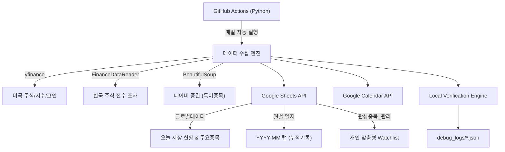

# 📊 Google Sheet Stock Updater

자동화된 주식/코인 시장 데이터 수집 및 구글 시트/캘린더 연동 시스템

## 🎯 주요 기능

- **제로 하드코딩 (Zero Hardcoding)**: 소스 수정 없이 시트에서 직접 지수(Index), 주요종목(Major), 관심종목(Watchlist) 관리 (v2.4.2)
- **자동 데이터 수집**: 한국/미국 주식, 주요 지수,
- **버전 히스토리**:
  - v2.6.9: 로컬 검증 시스템(tools/verify_sync.py) 도입 및 데이터 싱크 정합성 강화
  - v2.6.8: 세션 기반 '오늘' 탭 레이아웃 및 캘린더 연동 최적화 (MORNING/MIDDAY/CLOSE/EVENING)
  - v2.6.7: 리포트 3대 체제([주요/관심/특이]) 국가별 세분화 및 과거 데이터 동기화 정책 고도화
  - v2.6.5: Crypto 전용 카테고리 도입 및 대시보드(오늘 탭) 섹션 분리
  - v2.6.4: 기록 기준 날짜 최적화 (시장 데이터 날짜 대신 실제 실행일 기준 기록)
  - v2.6.3: initialize_sheet.py 경고 제거 및 오늘 탭 검증 로직 최적화
  - v2.6.2: 월별 탭 '버전' 컬럼을 '갱신날짜'로 변경 (타임스탬프 기록)

- **동적 종목 관리**: `관심종목_요청` 시트를 통한 간편한 종목 추가/삭제 및 카테고리 분류
- **데이터 보존**: 국장과 미장 업데이트 시점 차이로 인한 데이터 덮어쓰기 방지 (병합 로직)
- **주의종목 전수 조사**: `FinanceDataReader`와 네이버 증권을 활용한 상한가/고거래량 종목 탐지
- **구글 캘린더 연동**: 일별 시장 현황을 담은 투자일지 자동 생성 (중복 방지 로직 적용)
- **GitHub Actions 자동화**: 매일 자동 실행 (한국 시간 기준)

## 🏗️ 시스템 구조



### 시스템 계층 구조

1. **데이터 레이어 (Google Sheets)**: 글로벌데이터, 스크리너, 이벤트, 관심종목_관리
2. **연산 레이어 (Python/Github Actions)**: 수집, 분석(주의종목/추천의견), 포맷팅
3. **UI 레이어 (Calendar/Sheets)**: 일별 요약 이벤트, 실시간 시트 뷰어
4. **아카이빙 레이어 (Sheets)**: 월별 투자 기록 자동 보관

## ⚙️ 동작 환경

### 🔹 **실행 환경: GitHub Actions (클라우드)**

이 프로그램은 **GitHub Actions**에서 자동으로 실행됩니다:
- ✅ **로컬 환경 불필요**: 사용자 PC에 Python이나 라이브러리를 설치할 필요 없음
- ✅ **서버리스**: GitHub의 클라우드 서버에서 자동 실행
- ✅ **무료**: GitHub Actions 무료 사용량 내에서 운영

### 🔹 **로컬 실행 (선택사항)**

개발 또는 테스트 목적으로 로컬에서 실행하려면:

1. **.env 파일 설정**:
   - `.env.example`을 복사하여 `.env` 파일을 생성하고 실제 값을 입력합니다.
   - `GOOGLE_CREDENTIALS_JSON`은 서비스 계정 JSON 내용을 한 줄로 입력하거나 파일 경로를 사용합니다.

2. **라이브러리 설치**:
   ```bash
   pip install -r requirements.txt
   ```

3. **실행**:
   ```bash
   python updater.py
   ```

> ⚠️ **주의**: 로컬 실행은 개발/테스트 용도이며, 실제 운영은 GitHub Actions에서 자동으로 처리됩니다.

## 📋 설정 가이드

자세한 설정 방법은 [`docs/setup_guide.md`](docs/setup_guide.md)를 참조하세요.

### 필수 설정 항목

1. **Google Cloud 서비스 계정** 생성 및 JSON 키 다운로드
2. **Google Sheets** 공유 (서비스 계정 이메일로)
3. **Google Calendar** 공유 (서비스 계정 이메일로)
4. **GitHub Secrets** 등록:
   - `GOOGLE_CREDENTIALS_JSON`: 서비스 계정 JSON 키 전체 내용
   - `SPREADSHEET_ID`: 구글 시트 ID
   - `CALENDAR_ID`: 구글 캘린더 ID

### 1. 글로벌데이터 (Live Status)
| 섹션 | 설명 |
| :--- | :--- |
| **Market Summary** | 지수(KOSPI, S&P500 등) 및 환율 실시간 변동현황 |
| **주요 종목 데이터** | 설정된 주요 종목(AAPL, NVDA, 삼성전자 등)의 현재가 및 시총 |

### 2. 관심종목_관리 (DB 레이어)
시스템이 실시간 가격과 추천 정보를 자동으로 업데이트하는 핵심 DB 영역입니다.
- **컬럼**: `구분`, `카테고리`, `티커`, `종목명`, `테마`, `메모`, `알림가`, `시스템추천`, `전문가의견`, `정보링크`
- **자동 업데이트**: `테마`, `시스템추천`, `정보링크` (네이버/야후/주달 연동)

### 3. 월별 일지 (History Archive)
매월 `YYYY-MM` 형식의 탭이 자동 생성되며, 시장 요약과 특이 종목이 기록됩니다.
- **컬럼**: `날짜`, `시장 요약`, `관심종목 현황`, `주의종목`, `버전`

## 🔄 자동 실행 스케줄

GitHub Actions는 다음 시간에 자동 실행됩니다 (한국 시간 기준):

- **오전 08:01**: 미장 마감 및 NXT 시작 (전일 미장 최종 결과가 오늘 일지에 오전 브리핑으로 병합)
- **오후 12:01**: 국장 오전 세션 점검 (미드데이 브리핑)
- **오후 16:00**: 국장 정규장 마감 (국장 정규 세션 데이터 업데이트)
- **오후 20:01**: NXT 마감 및 이브닝 브리핑 (NXT 결과 및 미장 프리마켓 정보 업데이트)

> 스케줄 변경: `.github/workflows/daily_sync.yml` 파일의 `cron` 설정 수정

## 📁 프로젝트 구조

```
GoogleSheetStockUpdater/
├── updater.py              # 메인 프로그램
├── requirements.txt        # Python 의존성
├── .github/
│   └── workflows/
│       └── daily_sync.yml  # GitHub Actions 워크플로우
└── docs/
    ├── setup_guide.md      # 설정 가이드
    ├── walkthrough.md      # 기능 설명
    └── technical_spec.md   # 기술 사양
```

## 🛠️ 기술 스택

- **Python 3.x**
- **라이브러리**:
  - `yfinance`: 미국 주식/지수 데이터
  - `FinanceDataReader`: 한국 주식 시장 전수 조사 및 데이터
  - `BeautifulSoup4`: 네이버 증권 데이터 스크래핑
  - `python-dotenv`: 로컬 환경 변수 관리
  - `gspread`: Google Sheets API
  - `google-api-python-client`: Google Calendar API
  - `gspread-formatting`: 시트 서식 지정
- **자동화**: GitHub Actions

## 🌟 특별 기능

### 주의종목 전수 조사 (FDR)

단순한 상위 20개 랭킹을 넘어, 시장 전체 종목을 스캔하여 다음 조건에 맞는 종목을 모두 추출합니다:
- **상한가**: 29.5% 이상 상승한 모든 종목
- **고거래량**: 하루 거래량 500만 주 이상의 활발한 종목

## 🛠️ 유지보수 및 복구 (Maintenance)

이 프로젝트는 시스템의 안정성과 성능을 위해 **개발 역할**과 **유지보수 역할**을 엄격히 분리하여 설계되었습니다.

*   **`updater.py` (반복 실행/데이터 업데이트)**: 정해진 스케줄에 따라 실시간 데이터를 가져와 보고서를 작성하는 역할에 집중합니다. 매번 헤더를 검사하지 않으므로 속도가 빠르고 효율적입니다.
*   **`tools/initialize_sheet.py` (1회성 점검/유지보수)**: 시트 구조(Schema)가 깨졌거나, 한글화 등 구조적 변경이 필요할 때 사용합니다. 과거 기록을 포함한 모든 탭의 헤더를 한꺼번에 교정합니다.

### GitHub Actions를 통한 원격 복구

로컬 환경 없이 GitHub Actions에서 직접 복구 도구를 실행할 수 있습니다:

1.  **GitHub Repo -> Actions 탭**으로 이동합니다.
2.  **`Maintenance - Sheet Recovery`** 워크플로우를 선택합니다.
3.  **`Run workflow`** 버튼을 클릭하고 모드를 선택합니다:
    - **CHECK 모드 (권장)**: 모든 탭(과거 월별 기록 포함)의 헤더를 최신 한글 구조로 자동 교정하고, 부족한 탭을 생성합니다. (기본 지수 데이터 복구 포함, 기존 데이터 유지)
    - **RESET 모드**: 모든 시트를 삭제하고 공장 초기화 상태로 되돌립니다. (주의: `confirm_reset` 칸에 `yes`를 입력해야 실행됨)
    - **실행 방법**: GitHub Actions 탭 -> `Maintenance - Sheet Recovery` 선택 -> `Run workflow` 클릭

로컬에서 직접 실행하려면 다음 명령을 사용하세요:

```powershell
# 헤더 교정 및 1회성 구조 복구
python tools/initialize_sheet.py

# 시트 전체 초기화 (데이터 삭제 주의)
python tools/initialize_sheet.py --reset
```

## 🛠️ 고급 설정 (제로 하드코딩)

`관심종목_요청` 시트의 `Category` 컬럼을 통해 다음을 관리할 수 있습니다:

- **`Index`**: KOSPI, S&P500 등 시장 지수 (리포트 최상단 표시)
- **`Major`**: 삼성전자, 엔비디아 등 핵심 종목 (지수 본문 리포트 및 지수 옆에 포함)
- **`Watchlist`**: 개인 관심 종목 (관심종목 섹션에 표시)

### 깔끔한 캘린더 관리

- **제목 형식**: `투자일지 📈 KOSPI +0.75%` (날짜 제거, 중요 정보 우선)
- **중복 방지**: 같은 날짜에 실행 시 기존 투자일지를 자동 삭제하고 최신 정보로 갱신하여 캘린더를 깨끗하게 유지합니다.

## 📝 버전 히스토리

- **v2.4.4** (2026-01-11) [LATEST]:
  - **헤더 전면 한글화**: `티커`, `종목명`, `사용여부` 등 모든 컬럼명 한글 적용
  - **테마(Theme) 자동 수집**: 네이버/야후에서 해당 종목의 테마 정보 자동 연동
  - **정보 링크(Info Link) 추가**: 주달(Judal) 및 야후 파이낸스 상세 보기 링크 자동 생성
  - **관리 시트 구조 개선**: `구분` 컬럼 전면 배치 및 불필요한 중복 컬럼(`Country`) 삭제

- **v2.4.2** (2026-01-11):

- **v2.0.0** (2026-01-10):

- **v1.4.0** (2026-01-10):
  - 주말/휴장일 자동 감지 기능 추가
  - 주말에는 코인 데이터만 수집
  - 캘린더 이벤트 주말 전용 형식 추가
  - 월별 시트 Indices Info 컬럼 제거 (중복 제거)
  - 새 월별 탭 생성 시 최신 구조 자동 적용

## 📞 문의 및 기여

이슈나 개선 사항은 GitHub Issues를 통해 제안해주세요.

## 📄 라이선스

MIT License


==== 아래는 수정하지 마시오.
https://docs.google.com/spreadsheets/d/SHEET_ID/edit?gid=0#gid=0
tradingSystem2026 시트에 탭은 다음과 같이 구성 되어 있다. 글로벌데이터, @스크리너, @이벤트, @PnL로그 

A1: 티커	B1:종목명	C1: 거래소	D1: 종가	E1: 거래대금	F1: PER	G1: 시장	H1: 자동티커	G1: NASDAQ TOP
KRX:005930	삼성전자	코스피	#N/A	#N/A			Samsung Electronics Co Ltd	#N/A
=IFERROR(INDEX(SPLIT(IMPORTXML("https://finance.naver.com/item/main.naver?code="&RIGHT(A2,6),"//title"), " :"),1),"unknown")
=IFERROR(INDEX(IMPORTXML("https://finance.naver.com/item/main.naver?code="&SUBSTITUTE(A2,":",""),"//span[contains(text(),'코스피') or contains(text(),'KOSPI')]"),1),"KOSDAQ")
=GOOGLEFINANCE(A2, "price")
=GOOGLEFINANCE(A2, "volume") * GOOGLEFINANCE(A2, "price")